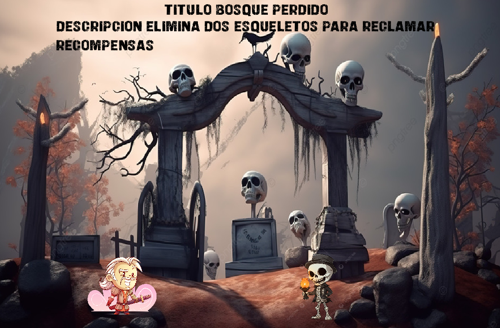
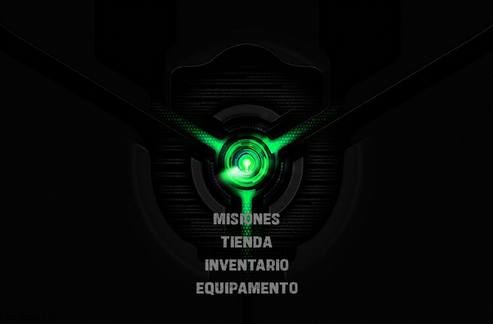
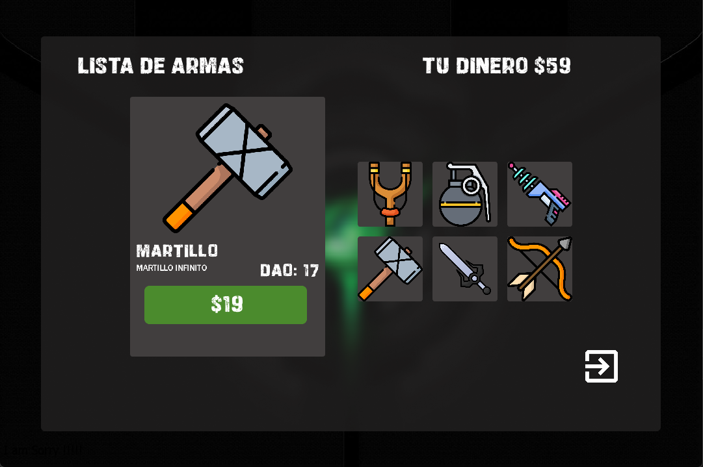
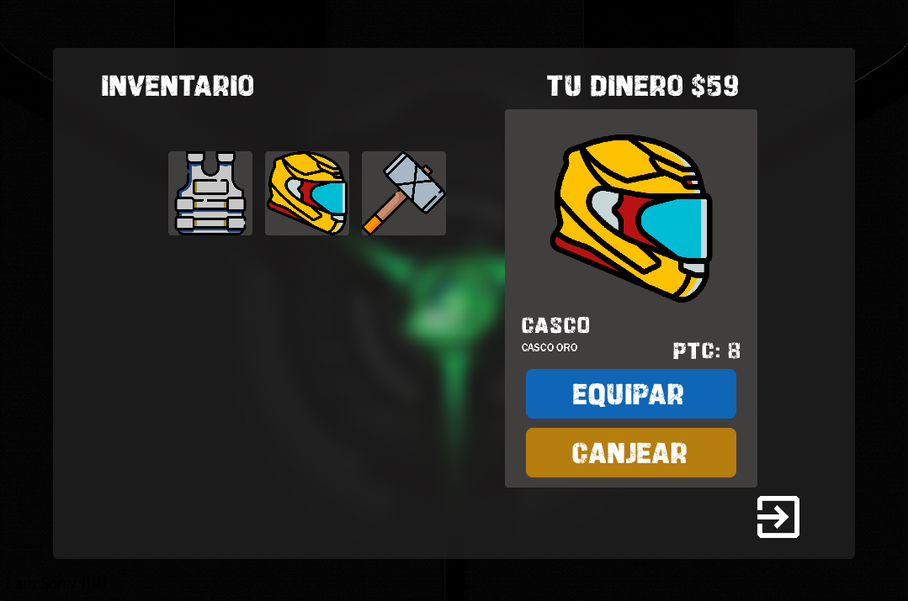

# AtackFire
Este videojuego 2D colaborativo lo diseñamos como un rpg con la libreria LIBGDX de Java ayudados de una base de datos, logramos hacerlo interactivo y puesto para expansion y un posible lanzamiento a una plataforma de juegos Arcade.



Mas imagenes del Juego





## Install
par instalar este juego simplemente cargas el archivo .sql ubicado en la ruta al gestor de base de datos. 
```bash
root
```
buildeas el proyecto con gradle.
Ejecuta en el bash el Comando.
```bash
gradle build
```
y ejecutas el jar.
```bash
java -jar build/libs/Calculator_Calidad_Test-1.0-SNAPSHOT.jar
```
